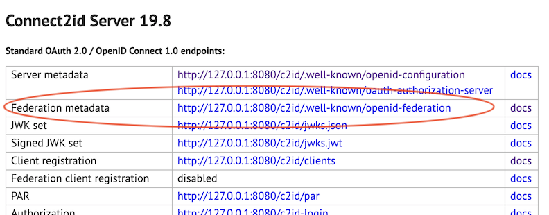

Since version 6.4.0, pac4j supports the [OpenID (Connect) Federation specification](https://openid.net/specs/openid-federation-1_0.html).

The OpenID Connect (in short, OIDC) support in pac4j (`pac4j-oidc` module) is strongly based on the Nimbus libraries:

```xml
<dependency>
    <groupId>com.nimbusds</groupId>
    <artifactId>oauth2-oidc-sdk</artifactId>
</dependency>
<dependency>
    <groupId>com.nimbusds</groupId>
    <artifactId>nimbus-jose-jwt</artifactId>
</dependency>
```

These are great Open Source libraries developed by the Connect2id team:
- [https://connect2id.com/products/nimbus-jose-jwt](https://connect2id.com/products/nimbus-jose-jwt)
- [https://connect2id.com/products/nimbus-oauth-openid-connect-sdk](https://connect2id.com/products/nimbus-oauth-openid-connect-sdk)

And as they also developed an OIDC server, let's test the pac4j OpenID Federation support with it!


## 1) Components

In this article, we will focus on the setup of this particular configuration more than entering into the details and options of each component.

We need 3 components:
- a client, which is called the Relying Party (RP) in OIDC, and we will use pac4j
- a server, which is called the OpenID Provider (OP) in OIDC, and we will use the Connect2id server
- a trust anchor (TA in short) and we will create a simulated one to simplify the whole installation.


### a) RP = pac4j

In the pac4j ecosystem, Spring Boot is the most popular web stack so let's use the `spring-webmvc-pac4j` implementation in action in this simple demo: [https://github.com/pac4j/simple-spring-boot-pac4j-demos/tree/oidc_federation_with_c2id/src/main/java/org/pac4j/demos](https://github.com/pac4j/simple-spring-boot-pac4j-demos/tree/oidc_federation_with_c2id/src/main/java/org/pac4j/demos):
- the `SpringBootDemo` class runs the Spring Boot demo
- the `SecurityConfig` class defines the security configuration (OIDC + URL protection)
- the `Application` class is a simple controller with two URLs: one public and the other one protected.

We need the following dependencies:

```xml
<dependency>
    <groupId>org.springframework.boot</groupId>
    <artifactId>spring-boot-starter-web</artifactId>
</dependency>
<dependency>
    <groupId>org.pac4j</groupId>
    <artifactId>spring-webmvc-pac4j</artifactId>
    <version>8.0.2</version>
</dependency>
<dependency>
    <groupId>org.pac4j</groupId>
    <artifactId>pac4j-oidc</artifactId>
    <version>6.4.0</version>
</dependency>
```


### b) OP = Connect2id

To make things easy, let's use the "Quick start" of the Connect2id server: [https://connect2id.com/products/server/docs/quick-start](https://connect2id.com/products/server/docs/quick-start)

Download the ZIP and unzip it. You will get a `connect2id-server-19.8` directory or something similar.

In that directory, you can:
- run the server: `tomcat/bin/startup.sh`
- stop the server: `tomcat/bin/shutdown.sh`
- change its configuration in the `tomcat/webapps/c2id/WEB-INF/oidcProvider.properties` file
- check the logs in the `tomcat/logs/c2id-server.log` file.


### c) TA is simulated

The trust anchor is a core component in our installation: it plays the role of the certificate authority.

We could use some specific existing software, but to make things easier, we will simulate it without entering into the details.


## 2) Configuration

Now that we have our 3 components, let's configure them to work together via the OpenID Federation protocol.

So far, when using the OpenID Connect protocol, you always need to define your client (`client_id` + `client_secret` + `redirect_uri`) at the server level to be able to perform the authentication process.

The OpenID Federation introduces the idea of trust and chain of trust between components to allow authenticating without registering upfront/at all.

And each component (entry) in the federation exposes its metadata on the new `.well-known/openid-federation` endpoint. A dedicated JWKS ensures security, similar to an X.509 certificate but without its complexity/difficulty.


## a) pac4j

As the Connect2id server runs by default on port 8080, we'll move our pac4j application to port 8081 via the configuration in the `application.properties` file:

```properties
server.port=8081
```

We update the `SecurityConfig` class to change the configuration for the federation:

```java
package org.pac4j.demos;

import com.nimbusds.jose.JWSAlgorithm;
import com.nimbusds.oauth2.sdk.auth.ClientAuthenticationMethod;
import org.pac4j.core.config.Config;
import org.pac4j.oidc.client.OidcClient;
import org.pac4j.oidc.config.OidcConfiguration;
import org.pac4j.oidc.config.method.PrivateKeyJwtClientAuthnMethodConfig;
import org.pac4j.oidc.federation.config.OidcTrustAnchorProperties;
import org.pac4j.springframework.config.Pac4jSecurityConfig;
import org.springframework.beans.factory.annotation.Value;
import org.springframework.context.annotation.Bean;
import org.springframework.context.annotation.Configuration;
import org.springframework.web.servlet.config.annotation.InterceptorRegistry;

import java.util.List;

@Configuration
public class SecurityConfig extends Pac4jSecurityConfig {

    @Value("${app.base-url:http://localhost:8080}")
    private String baseUri;

    @Bean
    public Config config() {
        final var config = new OidcConfiguration();

        final var rpJwks = config.getRpJwks();
        rpJwks.setJwksPath("file:./metadata/rpjwks.jwks");
        rpJwks.setKid("defaultjwks0426");
        config.setClientAuthenticationMethod(ClientAuthenticationMethod.PRIVATE_KEY_JWT);
        final var privateKeyJwtConfig = new PrivateKeyJwtClientAuthnMethodConfig(rpJwks);
        config.setPrivateKeyJWTClientAuthnMethodConfig(privateKeyJwtConfig);

        config.setRequestObjectSigningAlgorithm(JWSAlgorithm.RS256);

        final var federation = config.getFederation();

        federation.setTargetOp("http://127.0.0.1:8080/c2id");
        final var trust = new OidcTrustAnchorProperties();
        trust.setIssuer("http://localhost:8081/trustanchor");
        trust.setJwksPath("classpath:trustanchor.jwks");
        federation.getTrustAnchors().add(trust);

        federation.getJwks().setJwksPath("file:./metadata/oidcfede.jwks");
        federation.getJwks().setKid("mykeyoidcfede26");
        federation.setContactName("C2ID Test RP (Localhost)");
        federation.setContactEmails(List.of("jerome@casinthecloud.com"));

        federation.setEntityId("http://localhost:8081");

        return new Config(baseUri + "/callback", new OidcClient(config));
    }

    @Override
    public void addInterceptors(final InterceptorRegistry registry) {
        addSecurity(registry, "OidcClient").addPathPatterns("/protected/**");
    }
}
```

This new configuration needs explanations!

Notice that we don't have any `dicsoveryURI`, nor any `clientId` or `clientSecret`!

We need two JWKS for our setup here: one for the federation (to sign our entity statement) and one for the `private_key_jwt` client authentication (when calling the token endpoint).

The source code:

```java
final var rpJwks = config.getRpJwks();
rpJwks.setJwksPath("file:./metadata/rpjwks.jwks");
rpJwks.setKid("defaultjwks0426");
config.setClientAuthenticationMethod(ClientAuthenticationMethod.PRIVATE_KEY_JWT);
final var privateKeyJwtConfig = new PrivateKeyJwtClientAuthnMethodConfig(rpJwks);
config.setPrivateKeyJWTClientAuthnMethodConfig(privateKeyJwtConfig);
```

defines the JWKS used for the `private_key_jwt` client authentication. This will create a key named `defaultjwks0426` and save it as a JWKS in the `metadata/rpjwks.jwks` file.

We use the Request Object signing configuration as the federation requires more security:

```java
config.setRequestObjectSigningAlgorithm(JWSAlgorithm.RS256);
```

The JWKS used for signing here is the previous one defined in the `rpJwks` property.

In federation, you must define your trust anchor(s) (the root authority). So we do that with:

```
final var trust = new OidcTrustAnchorProperties();
trust.setIssuer("http://localhost:8081/trustanchor");
trust.setJwksPath("classpath:trustanchor.jwks");
federation.getTrustAnchors().add(trust);
```

It assumes the simulated TA is available at the `http://localhost:8081/trustanchor` URL with a JWKS also in the classpath (this is in the entity statement, but we rely on the one downloaded in the classpath).

The target OP (= the server we want to use for authentication) is of course the Connect2id and is defined by: `federation.setTargetOp("http://127.0.0.1:8080/c2id")`.

Finally, the entity identifier of our RP pac4j client is `http://localhost:8081` (its own base URL) thanks to `federation.setEntityId("http://localhost:8081")`.

As we don't have a `clientId`, the `entityId` is used to identify the RP.

It also means we must expose a dedicated OpenID federation endpoint (in the `Application` class):

```java
@Autowired
private Config config;

...

@RequestMapping(value = "/.well-known/openid-federation",  produces = DefaultEntityConfigurationGenerator.CONTENT_TYPE)
@ResponseBody
public String oidcFederation() throws HttpAction {
    final var oidcClient = (OidcClient) config.getClients().findClient("OidcClient").get();
    return oidcClient.getConfiguration().getFederation().getEntityConfigurationGenerator().generateEntityStatement();
}
```

## b) Connect2id

The Connect2Id server is available on the `http://127.0.0.1:8080/c2id` URL.

To enable federation, in the `tomcat/webapps/c2id/WEB-INF/oidcProvider.properties` file, you need to change:

```properties
### Federation ###

# Enables / disables OpenID Federation 1.0. Disabled by default.
op.federation.enable=true

# The configured trust anchors. Leave blank if none.
op.federation.trustAnchors.1=http://localhost:8081/trustanchor

# Trust anchors or intermediate entities that may issue an entity statement
# about this OpenID provider. Leave blank if none.
op.federation.authorityHints.1=http://localhost:8081/trustanchor
op.federation.authorityHints.2=
op.federation.authorityHints.3=

# The enabled OpenID Federation 1.0 client registration types. The default
# value is none (for deployments that use manual client registration only).
#
# Supported OpenID Federation 1.0 client registration types:
#
#     * explicit
#     * automatic
#
op.federation.clientRegistrationTypes=automatic

# The enabled methods for authenticating OpenID Federation 1.0 automatic client
# registration requests at the OAuth 2.0 authorisation endpoint.
#
# Supported methods:
#
#     * request_object
#
op.federation.autoClientAuthMethods.ar=request_object
```

The parameters are quite obvious: `op.federation.enable=true` to enable the federation.

The trust anchor is defined twice:

```
op.federation.trustAnchors.1=http://localhost:8081/trustanchor
op.federation.authorityHints.1=http://localhost:8081/trustanchor
```

And we use the automatic registration mode (the simplest way): `op.federation.clientRegistrationTypes=automatic`.

Stop and start again the Connect2id server. You should see this welcome page on `http://127.0.0.1:8080/c2id`:



Meaning the federation is properly enabled.


## c) Simulated TA

For the simulated trust anchor, let's not enter into the details to limit the size of this article.

We expose a few endpoints to simulate its behavior and the contract it must respect (in the `Application` class):

```java
@GetMapping(value = "/trustanchor/.well-known/openid-federation", produces = DefaultEntityConfigurationGenerator.CONTENT_TYPE)
@ResponseBody
public String trustAnchorWellKnown() throws Exception {
    return "eyJraWQiOiJ0YS1rZX...vBabK4L897BynKoyihoUHj4Q";
}

@GetMapping(value = "/trustanchor/fetch", produces = DefaultEntityConfigurationGenerator.CONTENT_TYPE)
@ResponseBody
public String trustAnchorFetch(final HttpServletRequest request) throws Exception {
    final var sub = request.getParameter("sub");
    if (sub.contains("127.0.0.1")) { // OP
        return "eyJraWQiOiJ0YS1rZX...ldEVZd49QyZRnENUCP4hOMCWiQ";
    } else { // RP
        return "eyJraWQiOiJ0YS1rZX...n94DBmi3m158dbEO2ZWyM_9YdWtxjerAl1Zh-bgzA6H17tRGlk-oYd-7g";
    }
}
```

And add the `trustanchor.jwks` to the `src/main/resources` directory.


## 3) Let's log in

Now we run our pac4j Spring Boot RP and our Connect2id OP server.

Let's add more logs on the pac4j side via: `logging.level.org.pac4j.oidc=DEBUG` (in the `application.properties` file).

Open the `http://localhost:8081/` URL in your browser and click on the `Protected area` link.

Ta-da! It works: the Connect2id login page is displayed and we can log in with the default `alice`/ `secret` user/password.

The pac4j logs:

```
```

The Connect2id logs:

```
```

Without going too deep in the logs, we can see that both sides are checking federation endpoints and entity statements to establish the trust chain.

And here is the big thing:

**The pac4j RP and the Connect2id OP only know and rely on the trust anchor, they don't know each other.**

**But nonetheless the RP can perform the authentication process on the OP!**
